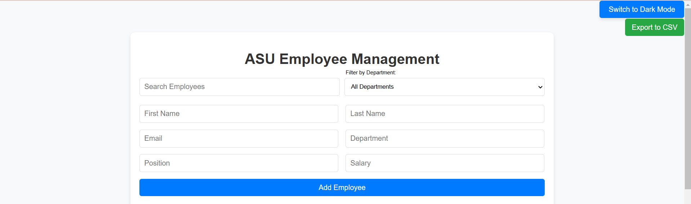
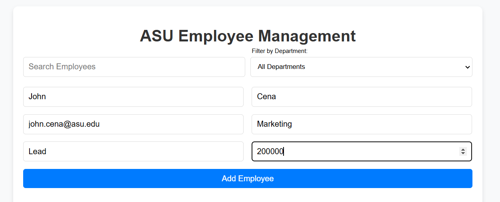
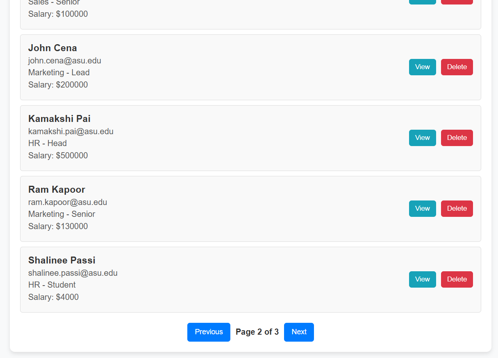
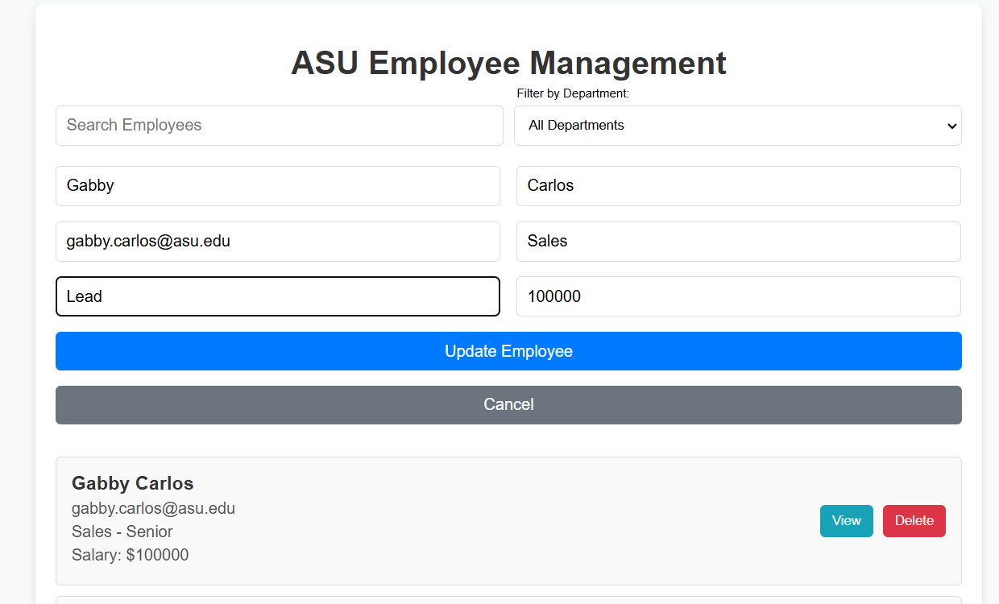
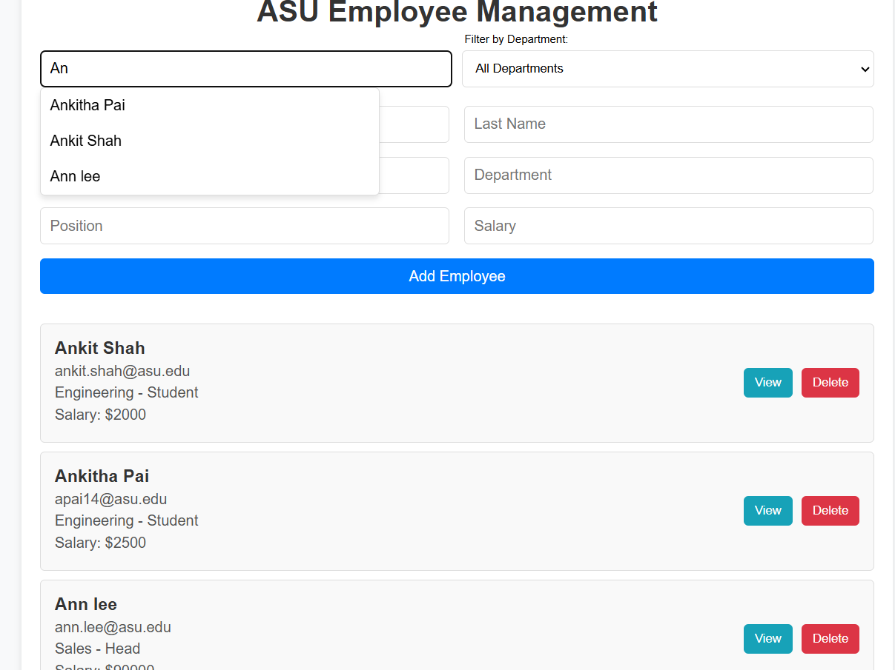
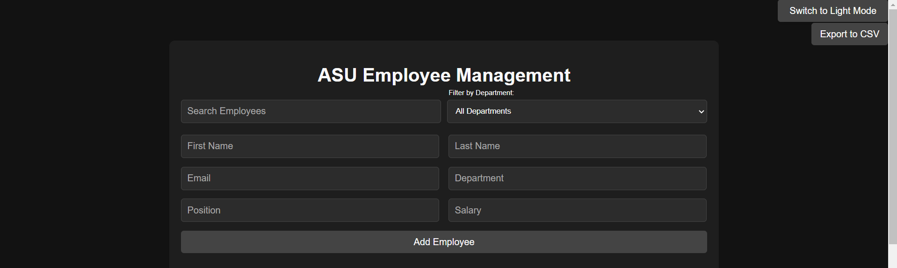

# Employee Management System

A full-stack application to manage employees, built with Flask for the backend, React for the frontend and ElasticSearch for the database.

## Key Features
- Employee CRUD operations: Effortlessly create, read, update, and delete employee records.
- Search and autocomplete: Exact match, partial matching and suggestions provided for autocomplete.
- Pagination.
- Dark mode toggle.
- Export to CSV.

## Technologies Used
- Backend: Python, Flask
- Database: Elasticsearch
- Frontend: React, Node.js

## Setup Instructions

### Prerequisites
Ensure you have the following installed on your system:
- Python 3.7 or above
- Node.js and npm
- Elasticsearch (set up locally or use a hosted version)

1. Clone this repository to your local machine:
  ```bash
  git clone https://github.com/<your_username>/employee_records_management.git
  ```
2. Run Elasticsearch locally:
Follow the [Setup Guide](https://www.elastic.co/guide/en/elasticsearch/reference/index.html) to install and run Elasticsearch.
3. Start the Backend: Run the Flask backend by navigating to the backend folder and executing the app.py script:
   ```bash
   python app.py
   ```
5. Start the frontend: Run the react frontend by navigating to the frontend folder and executing:
   ```bash
   npm rum
   ```
6. Open your browser and visit:

Frontend: [Frontend link](http://localhost:3000)
Backend: [Backend link](http://localhost:5000)

## Screenshots

### Light View Form


### Create Employee


### Data View Pagination


### Update Employee


### Search View


### Dark View Form



## Future Features
- Authentication & Role-Based Access: Secure login for administrators and employees.
- Enhanced Employee Profiles: Allow profile creation and updates with additional fields.
- File Uploads: Enable profile picture uploads using file storage.
- Bulk Uploads: Provide an option to upload employee datasets for administrative purposes.
- Enhanced Analytics: Visualize employee data with interactive charts and dashboards.

